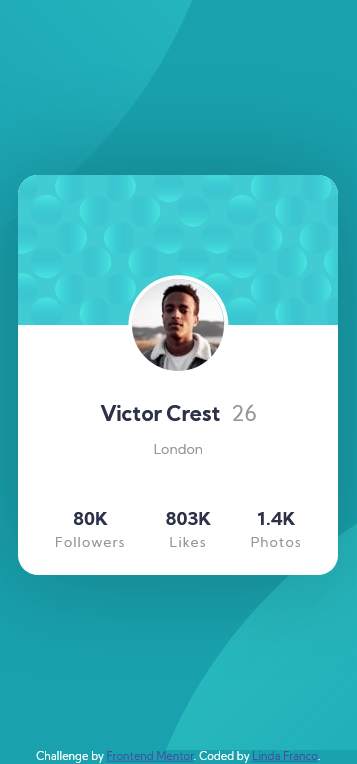

# Frontend Mentor - Profile card component solution

This is a solution to the [Profile card component challenge on Frontend Mentor](https://www.frontendmentor.io/challenges/profile-card-component-cfArpWshJ). Frontend Mentor challenges help you improve your coding skills by building realistic projects. 

## Table of contents

- [The challenge](#the-challenge)
- [Screenshot](#screenshot)
- [Links](#links)
- [Built with](#built-with)
- [What I learned](#what-i-learned)
- [Useful resources](#useful-resources)
- [Author](#author)

### The challenge

- The challenge is based on making a letter with information from a user

### Screenshot

- This screenshot is based on my solution in desktop design.

- This screenshot is based on my solution in mobile design with only one layout (375px)

### Links

- Solution URL: [Add solution URL here](https://your-solution-url.com)
- Live Site URL: [Add live site URL here](https://your-live-site-url.com)

### Built with

- Semantic HTML5 markup
- CSS custom properties
- Flexbox

### What I learned

In this challenge I learned how to better accommodate things with flexbox, it was something I kept struggling with, but I was able to improve

### Useful resources

- [Example resource 1 - w3schools](https://www.w3schools.com/css/css3_flexbox.asp) - This helped me with the problem of aligning the components that I was creating, since I didn't understand well why certain things were not accommodated, but in the end reading more information I saw where my error was.

## Author

- Website - [Linda Franco](https://lindafranco96.github.io/My-portfolio/)
- Frontend Mentor - [@LindaHyuk](https://www.frontendmentor.io/profile/LindaHyuk)
